# github-actions — MCP server for one/many GitHub repo(s)

Exposes the GitHub surface (repo, files, issues, PRs, Actions runs, releases,
webhooks, search, …) as MCP tools for a single configured repository.



## 1. Configuration

Create `.env` next to `main.py`:

```text
ACCESS_TOKEN=github_pat_xxx
GITHUB_REPO=owner/repo
```

Install and verify:

```bash
uv sync
.venv\Scripts\python.exe verify_mcp.py     # prints the tool list + a whoami probe
```

## 2. Register with pi (or any MCP host)

Add to `C:\Users\archi\.config\mcp\mcp.json` (top-level key is `mcpServers`):

```json
{
  "mcpServers": {
    "github-actions": {
      "command": "C:\\Users\\archi\\Desktop\\Testing\\Code\\MCP\\Github_Actions\\.venv\\Scripts\\python.exe",
      "args": [
        "C:\\Users\\archi\\Desktop\\Testing\\Code\\MCP\\Github_Actions\\main.py"
      ], }
    }
}
```

Then run **`/reload`** in pi (config is read at startup). Confirm with `mcp({})`:
`github-actions (66 tools)`.

## 3. Use

In pi, the tools appear as `github-actions_<tool>` — or call them through the gateway:

```js
mcp({ server: "github-actions" })                          // list every tool
mcp({ tool: "github-actions_list_workflow_runs", args: { per_page: 5 } })
mcp({ search: "open a pull request" })                      // semantic/lexical tool search
```

Every tool takes an optional `repo` argument; omit it to use `GITHUB_REPO`.
Start with `github-actions_whoami` when a call fails — it reports config, token, and reachability.

```bash
# direct, without pi
.venv\Scripts\python.exe -c "import main; print(main.repo_info())"
```

## Tools by area (66)

| Area | Tools |
| --- | --- |
| Repo | `repo_info` `repo_settings` `edit_repo` `repo_branches` `repo_tags` `repo_languages` `repo_topics` `create_branch` `create_tag` `repo_events` `archive_repo` |
| Files | `list_directory` `read_file` `create_or_update_file` `delete_file` `file_history` |
| Commits | `list_commits` `commit_detail` `compare_commits` |
| Issues | `create_issue` `list_issues` `get_issue` `update_issue` `comment_on_issue` `list_issue_comments` `lock_issue` |
| Labels/milestones | `list_labels` `create_label` `list_milestones` `create_milestone` |
| Pull requests | `create_pull_request` `list_pull_requests` `get_pull_request` `update_pull_request` `merge_pull_request` `create_pull_review` `request_reviewers` |
| Releases | `list_releases` `create_release` `upload_release_asset` |
| Actions | `list_workflows` `get_workflow` `dispatch_workflow` `list_workflow_runs` `get_workflow_run` `rerun_workflow` `cancel_workflow_run` `run_logs` |
| CI/CD | `list_check_runs` `combined_status` `create_check_run` `list_deployments` |
| Access/infra | `list_collaborators` `add_collaborator` `remove_collaborator` `list_webhooks` `create_webhook` `delete_webhook` `list_secrets` |
| Search/user | `search_code` `search_issues` `search_users` `current_user` `list_gists` `create_gist` |
| Health | `whoami` |

## Token permissions

Fine-grained PAT: **Contents** (read/write), **Issues**, **Pull requests**, **Actions**,
**Metadata** (always required), plus **Checks** for `list_check_runs`/`combined_status`
and **Administration** for webhooks/settings. A missing scope returns
`{"error": ..., "status": 403}` instead of failing silently.
